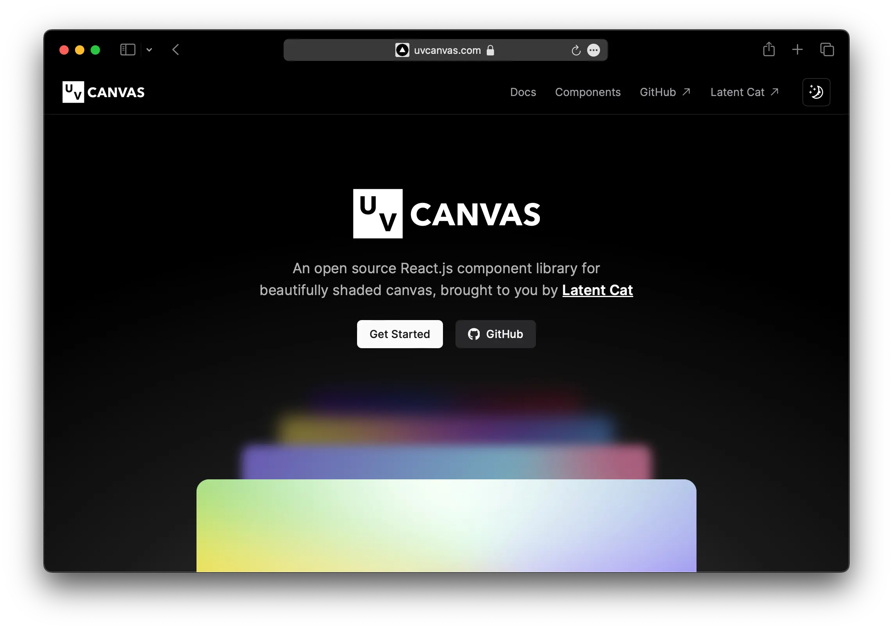

# UVCanvas-vue

### WIP - This project is still in development and not ready for production use.

An open source Vue.js component library for beautifully shaded canvas, brought to you by **[Latent Cat](https://latentcat.com)**.

## Documentation

Visit [uvcanvas.com/docs](https://uvcanvas.com/docs) to view the documentation.

## License

Licensed under the [MIT license](https://github.com/shadcn/ui/blob/main/LICENSE.md).
